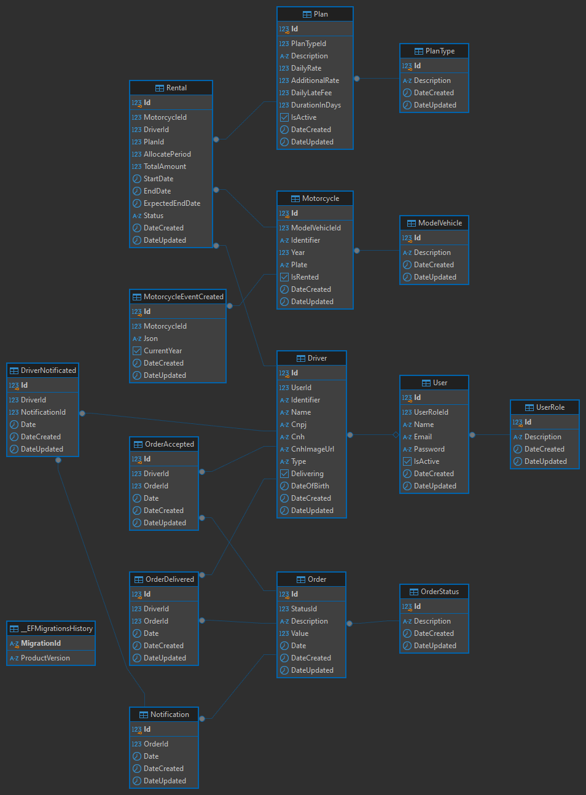

# Mottu

Este projeto tem como objetivo desenvolver uma aplicação para gerenciar o aluguel de motos e a administração de entregadores, permitindo que, uma vez registrados e com locações ativas, os entregadores realizem entregas de pedidos disponíveis, otimizando a logística e aumentando a eficiência do serviço. Este projeto é inspirado no repositório [Clean Architecture Manga](https://github.com/ivanpaulovich/clean-architecture-manga), que oferece uma abordagem robusta para a construção de aplicações bem estruturadas.

## Tecnologias Utilizadas

- **.NET 8 Web API**: Para construção da API.
- **PostgreSQL**: Banco de dados relacional para armazenamento de dados.
- **RabbitMQ**: Sistema de mensageria para comunicação entre serviços.
- **Testcontainers**: Para testes de integração com contêineres.
- **Firebase**: Para upload de imagens.
- **Swagger**: Documentação da API e versionamento.
- **Microsoft Extensions**: Para configuração e extensão da aplicação.

## Arquitetura

Este projeto adota princípios de **Clean Architecture**, **Onion Architecture** e **Hexagonal Architecture**, promovendo uma clara **Separação de Preocupações**. A estrutura é dividida em:

- **Domain**: Contém as entidades e regras de negócio.
- **Application**: Contém casos de uso e lógicas de aplicação.
- **Infrastructure**: Implementações concretas como acesso a dados.
- **User Interface**: Interface do usuário, onde a API é exposta aos clientes.

## Recursos

- **EF Core**: Para acesso a dados com um padrão de repositório.
- **Feature Flags**: Para ativação/desativação de funcionalidades em tempo real.
- **Logging**: Implementação de registro de logs para monitoramento e depuração.
- **Data Annotation**: Validação de dados nos modelos.

## Segurança

- **Authentication**: Implementação de autenticação de usuários via Firebase.
- **Authorization**: Controle de acesso baseado em roles e permissões.

## Padrões e Práticas

- **SOLID**: Princípios de design que orientam a estruturação do código.
- **Unit Of Work**: Padrão para gerenciar transações.
- **Repository**: Padrão de projeto que abstrai a lógica de acesso a dados.
- **Use Case**: Organização das operações da aplicação.
- **Presenter Custom**: Lógica para formatação e apresentação dos dados.

## Testes

- **API Test**: Conjunto de testes automatizados para garantir a funcionalidade da API.
	Com 399 testes, é recomendável executá-los individualmente.
- **Testcontainers**: Usado para testes de integração com ambientes isolados.

## Configuração e Execução

Para rodar o projeto localmente, siga os passos abaixo:

1. **Certifique-se de que o Docker esteja instalado em sua máquina.** 
Você pode baixar e instalar o Docker [aqui](https://www.docker.com/get-started).
2. **Clone o repositório:**
git clone https://github.com/henriqueandradesilva/rental.git
3. **Abra a solução no Visual Studio:**
Localize e abra o arquivo Mottu Solution.sln.
4. **Defina o projeto docker-compose como o projeto de inicialização:** 
Clique com o botão direito no projeto docker-compose no Gerenciador de Soluções e selecione "Definir como Projeto de Inicialização".
5. **Execute a aplicação:** 
Pressione F5 ou clique em "Iniciar" para executar a aplicação.
6. **Acesse a documentação Swagger:**
Abra o navegador e acesse: https://localhost:8081/swagger/index.html.

## Acesso de Administrador

Para fazer login como administrador, utilize as seguintes credenciais:

- **E-mail:** admin@mottu.app
- **Senha:** 1

## Coleção Postman

Esta coleção contém as requisições para a API. 

*Arquivo: [Coleção Postman](./documents/WebApi.postman_collection.json)*

## Api Tests

Alguns testes...

## Padrão de Arquitetura

Aqui está uma visão geral da arquitetura do sistema.

## Diagrama de Entidade Relacionamento (DER)

O diagrama abaixo ilustra as entidades e seus relacionamentos.

# Desafio backend Mottu

Seja muito bem-vindo ao desafio backend da Mottu! Obrigado pelo interesse em fazer parte do nosso time e ajudar a melhorar a vida de milhares de pessoas.

## Instruções
- O desafio é válido para diversos níveis, portanto não se preocupe se não conseguir resolver por completo.
- A aplicação só será avaliada se estiver rodando; se necessário, crie um passo a passo para isso.
- Faça um clone do repositório em seu git pessoal para iniciar o desenvolvimento e não cite nada relacionado a Mottu.
- Após finalização, envie um e-mail para o recrutador informando o repositório para análise.

## Requisitos não funcionais 
- A aplicação deverá ser construída com .Net utilizando C#. ✅
- Utilizar apenas os seguintes bancos de dados (Postgres, MongoDB) ✅
    - Não utilizar PL/pgSQL. ✅
- Escolha o sistema de mensageria de sua preferência 
(RabbitMQ, SQS/SNS, Kafka, Google Pub/Sub ou qualquer outro). ✅

## Aplicação a ser desenvolvida
Seu objetivo é criar uma aplicação para gerenciar aluguel de motos e entregadores. Quando um entregador estiver registrado e com uma locação ativa, poderá também efetuar entregas de pedidos disponíveis na plataforma.
Iremos executar um teste de integração para validar os cenários de uso. Por isso, sua aplicação deve seguir exatamente as especificações de APIs REST do nosso Swagger: request, response e status code. Garanta que os atributos dos JSONs estejam de acordo com o Swagger abaixo.

## Swagger de referência
[Swagger de referência](https://app.swaggerhub.com/apis-docs/Mottu/mottu_desafio_backend/1.0.0)

## Casos de uso
- Eu como usuário admin quero cadastrar uma nova moto.✅
  - Os dados obrigatórios da moto são Identificador, Ano, Modelo e Placa.✅
  - A placa é um dado único e não pode se repetir.✅
  - Quando a moto for cadastrada, a aplicação deverá gerar um evento de moto cadastrada.✅
    - A notificação deverá ser publicada por mensageria. ✅
    - Criar um consumidor para notificar quando o ano da moto for "2024". ✅
    - Assim que a mensagem for recebida, deverá ser armazenada no banco de dados para consulta futura. ✅
- Eu como usuário admin quero consultar as motos existentes na plataforma e conseguir filtrar pela placa. ✅
- Eu como usuário admin quero modificar uma moto alterando apenas sua placa que foi cadastrada indevidamente. ✅
- Eu como usuário admin quero remover uma moto que foi cadastrada incorretamente, desde que não tenha registro de locações. ✅
- Eu como usuário entregador quero me cadastrar na plataforma para alugar motos. ✅
    - Os dados do entregador são (identificador, nome, CNPJ, data de nascimento, número da CNH, tipo da CNH, imagem da CNH). ✅
    - Os tipos de CNH válidos são A, B ou ambas A+B. ✅
    - O CNPJ é único e não pode se repetir. ✅
    - O número da CNH é único e não pode se repetir. ✅
- Eu como entregador quero enviar a foto de minha CNH para atualizar meu cadastro. ✅
    - O formato do arquivo deve ser PNG ou BMP. ✅
    - A foto não poderá ser armazenada no banco de dados; você pode utilizar um serviço de storage (disco local, Amazon S3, MinIO ou outros). ✅
- Eu como entregador quero enviar a foto de minha cnh para atualizar meu cadastro. ✅
    - O formato do arquivo deve ser png ou bmp. ✅
    - A foto não poderá ser armazenada no banco de dados, você pode utilizar um serviço de storage( disco local, amazon s3, minIO ou outros). ✅
- Eu como entregador quero alugar uma moto por um período. ✅
    - Os planos disponíveis para locação são:
        - 7 dias com um custo de R$30,00 por dia ✅
        - 15 dias com um custo de R$28,00 por dia ✅
        - 30 dias com um custo de R$22,00 por dia ✅
        - 45 dias com um custo de R$20,00 por dia ✅
        - 50 dias com um custo de R$18,00 por dia ✅
    - A locação obrigatóriamente tem que ter uma data de inicio e uma data de término e outra data de previsão de término. ✅
    - O inicio da locação obrigatóriamente é o primeiro dia após a data de criação. ✅
    - Somente entregadores habilitados na categoria A podem efetuar uma locação ✅
- Eu como entregador quero informar a data que irei devolver a moto e consultar o valor total da locação. ✅
    - Quando a data informada for inferior a data prevista do término, será cobrado o valor das diárias e uma multa adicional ✅
        - Para plano de 7 dias o valor da multa é de 20% sobre o valor das diárias não efetivadas. ✅
        - Para plano de 15 dias o valor da multa é de 40% sobre o valor das diárias não efetivadas. ✅
    - Quando a data informada for superior a data prevista do término, será cobrado um valor adicional de R$50,00 por diária adicional. ✅
